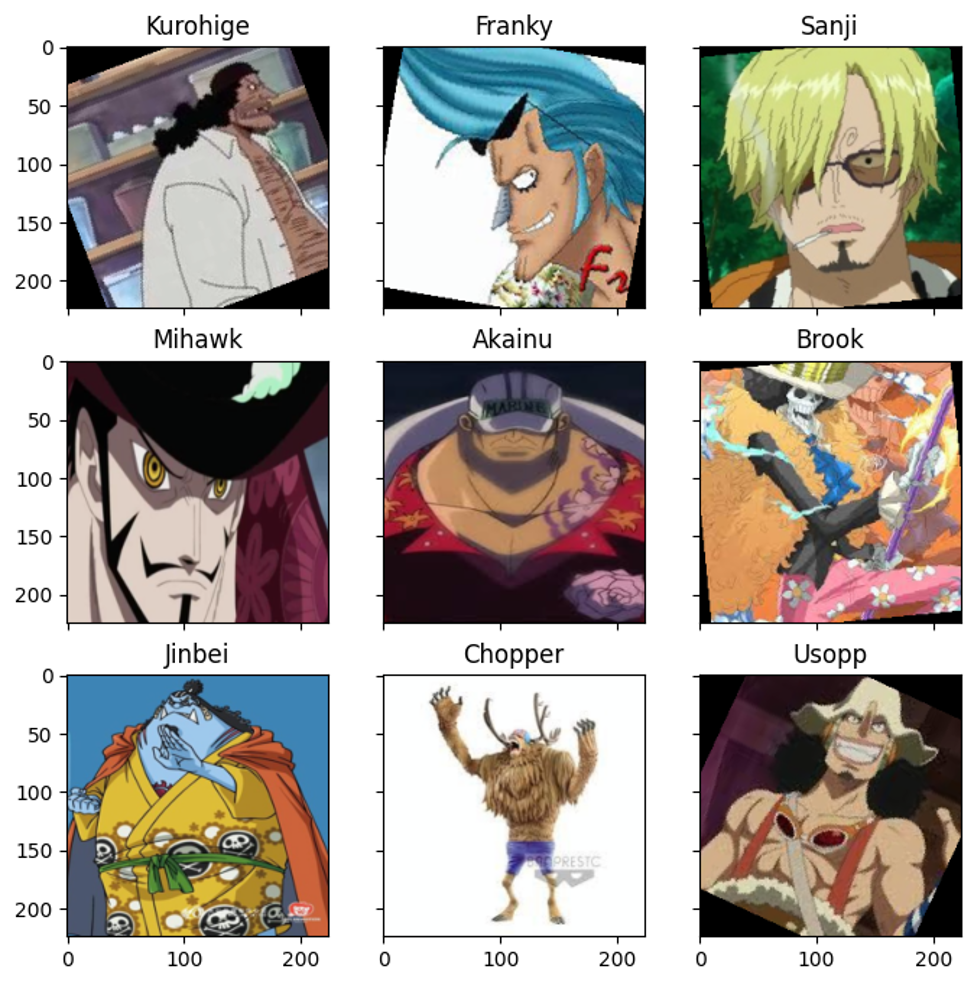
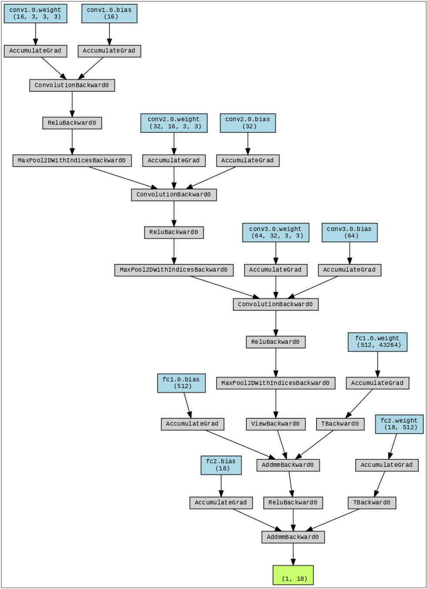
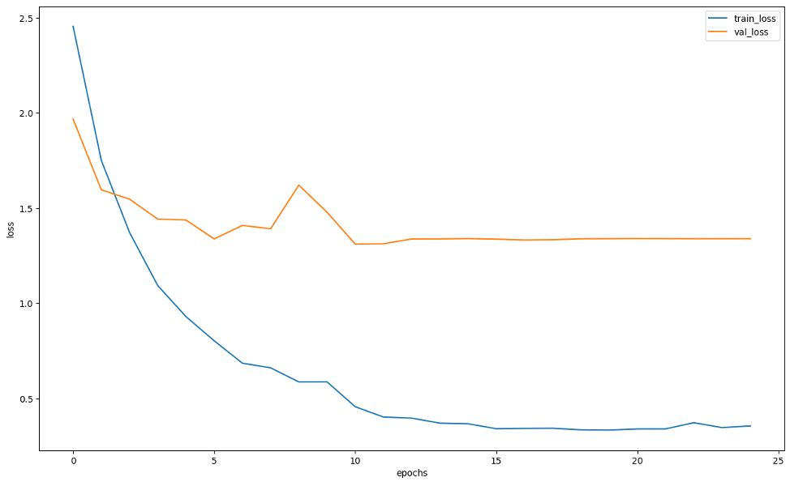
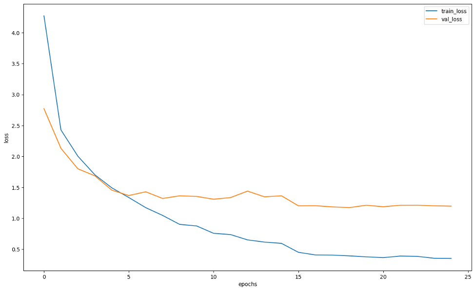
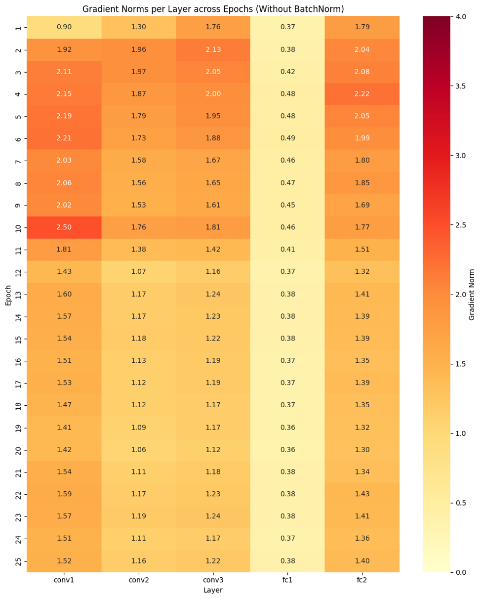
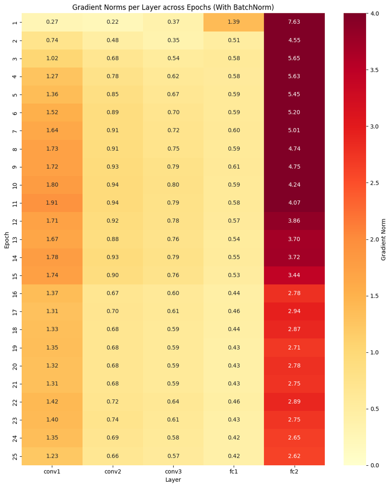
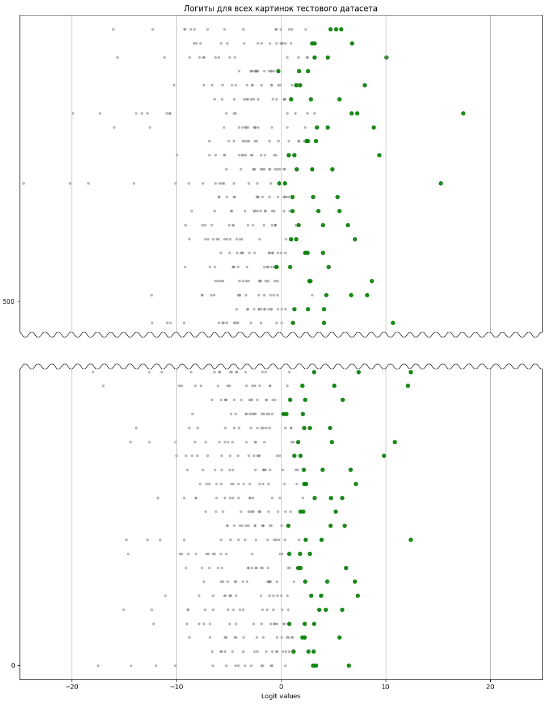
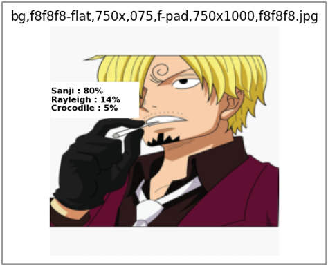
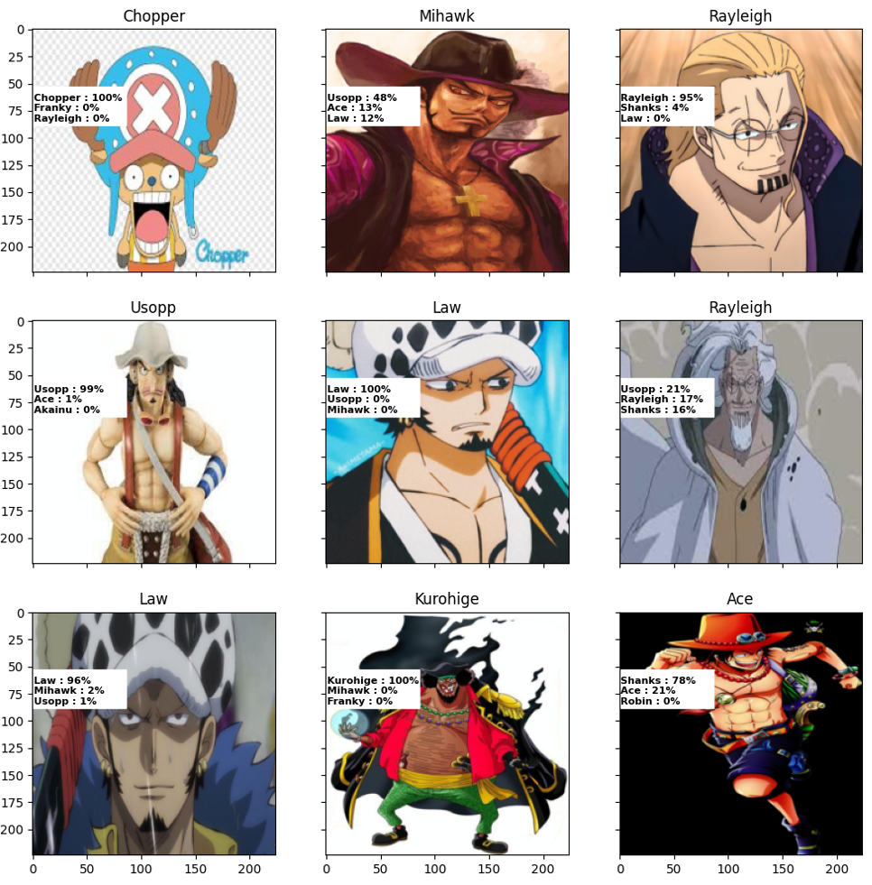
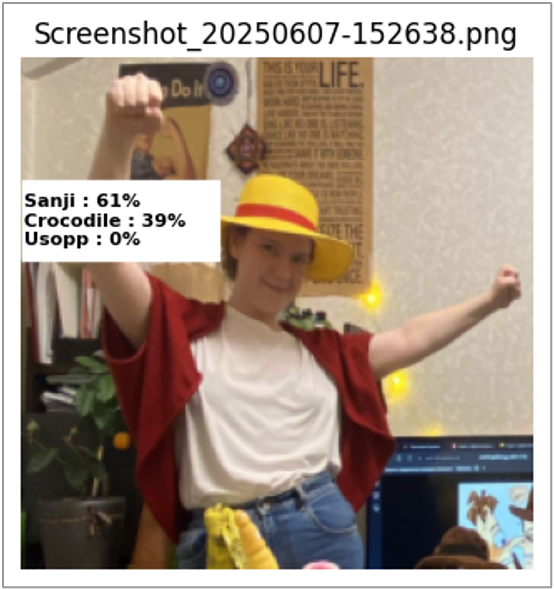

# Постановка задачи

**Целью** данной работы было исследование влияния различных факторов на обучение сверточной нейросети в задаче мульти-классовой классификации изображений. Задание включало:

- анализ влияния Batch Normalization (BN);
- измерение средних норм градиентов на слоях в процессе обучения, в частности на последней эпохе обучения;
- сравнение функций SoftMax и SparseMax на выходном слое.

Дополнительно проводился анализ структуры сети, качества классификации, переобучения, и поведения логитов. Исследование выполнено на пользовательском датасете с персонажами из аниме One Piece.

# Описание датасета и предобработка

## Структура датасета

Структура исходного датасета представлена ниже.

```text
Data_OnePiece/
├── Luffy/
│   ├── img1.jpg
│   └── ...
├── Zoro/
│   ├── img1.jpg
│   └── ...
├── Nami/
│   └── ...
...
```

## Аугментация

Исходный датасет содержал 3705 изображений 18 классов (персонажей). После удаления уже присутствующих, но некачественных, аугментаций и добавления собственных (горизонтальный флип, кроп, поворот), обучающая выборка была расширена до 6298 изображений за счёт дублирования и агрессивной аугментации каждого дубликата.

Датасет до аугментации был разбит на:

- обучающую выборку — 70%;
- валидационную — 15%;
- тестовую — 15%.

Каждое изображение нормализовалось по стандарту ImageNet, преобразовывалось к 224x224 и превращалось в тензор.

## Пример train-выборки после аугментации



# Архитектура модели

Изначально использовалась сеть из 5 сверточных и 3 полносвязных слоев. Однако из-за переобучения уже на 5–6 эпохах, сеть была упрощена и были добавлены регуляризации:
- сверточные слои: 5 → 3;
- полносвязные слои: 3 → 2;
- добавлены Dropout ( p=0.4), а также в оптимизаторе использовались L2-регуляризация и LR-scheduler;
- эксперименты проводились как с BN, так и без него.

## Структура нейросети

Ниже представлена структура нейросети в форматах таблицы и схемы (созданных средствами библиотек torchsummary и torchviz)

```text
        Layer (type)               Output Shape         Param #
================================================================
            Conv2d-1         [-1, 16, 222, 222]             448
              ReLU-2         [-1, 16, 222, 222]               0
         MaxPool2d-3         [-1, 16, 111, 111]               0
            Conv2d-4         [-1, 32, 109, 109]           4,640
              ReLU-5         [-1, 32, 109, 109]               0
         MaxPool2d-6           [-1, 32, 54, 54]               0
            Conv2d-7           [-1, 64, 52, 52]          18,496
              ReLU-8           [-1, 64, 52, 52]               0
         MaxPool2d-9           [-1, 64, 26, 26]               0
           Linear-10                  [-1, 512]      22,151,680
             ReLU-11                  [-1, 512]               0
          Dropout-12                  [-1, 512]               0
           Linear-13                   [-1, 18]           9,234
================================================================
Total params: 22,184,498
Trainable params: 22,184,498
Non-trainable params: 0
```



# Влияние Batch Normalization

Для оценки влияния BatchNorm были обучены две версии модели: с BN и без. Использовался один и тот же план обучения, идентичные параметры и одинаковые аугментации. Сравнивались:
- динамика потерь (train/val);
- метрики на тесте (Acc, F1);
- динамика норм градиентов по слоям (см. следующий параграф).

**Результаты:**

- BN сглаживает тренировочную динамику и замедляет переобучение;
- Нормы градиентов при использовании BN стабильнее и выше в последних слоях (см. тепловую карту в следующем параграфе);
- Тестовые метрики показывают одинаковые результаты как с BN так и без нее.

График динамики потерь на train выборке и val-выборке без Batch Normalization:



График динамики потерь на train выборке и val-выборке с Batch Normalization:



## Метрики качества

Метрики рассчитывались на тестовой выборке для разных эпох. Проводилось сравнение на эпохах 4–24. Лучшая модель сохранена и использована для финального тестирования.

| Модель | Epoch (лучшая) |  Accuracy | F1 (micro)  |
|--------|----------------|---|---|
|      Без BN  | 15             |  0.6691 |  0.6691 |
|     С BN   | 17             | 0.6619  | 0.6619  |


# Градиенты в процессе обучения

Во время каждой эпохи собирались значения нормы градиента по слоям, усреднённые по батчам. Основная цель — отследить "затухание градиента" (vanishing gradient).
Наблюдения:
- в сетях без BN нормы градиентов больше на conv2 и conv3, но сильно меньше на последнем fc2;
- с BN — более равномерное распределение по слоям;
- в обоих случаях после 10-ой эпохи сеть уже "запоминает" тренировочную выборку, начинается переобучение.
- в плане динамики нормы градиента по эпохам разницы нет

Динамика изменения средней нормы градиентов функции потерь по весам на каждом слое по эпохам без Batch Normalization и с Batch Normalization представлена ниже.

Динамика изменения средней нормы градиентов функции потерь по весам на каждом слое по эпохам без Batch Normalization:



Динамика изменения средней нормы градиентов функции потерь по весам на каждом слое по эпохам с Batch Normalization:



# Сравнение SoftMax и SparseMax

Для понимания среднего распределения логитов на всём датасете была визуализирована зависимость значений логитов, соответствующих каждому из 18-ти классов (по оси абсцисс), от номера изображения (по оси ординат):



Для вывода вероятностей на последнем слое тестировались:
- SoftMax (классическая);
-	SoftMax (стабильная);
-	SparseMax (даёт разреженные вероятности, интерпретируемость и отбрасывание незначимых классов).

Ключевые отличия:
-	SparseMax обнуляет ненужные классы → топ-3 классы проще интерпретировать;
-	SoftMax распределяет вес по всем классам, в том числе мусорным.

Пример работы SoftMax и SparseMax на конкретном изображении:
Исходные логиты для данного изображения Sanji до применения SoftMax/SparseMax

```text
-2.0850  Ace
-3.0753  Akainu
-8.3504  Brook
-0.7954  Chopper
 1.0111  Crocodile   ✅
-6.6878  Franky
-8.6665  Jinbei
-9.4827  Kurohige
-3.4167  Law
-2.2512  Luffy
-3.6292  Mihawk
-3.4578  Nami
 2.0929  Rayleigh    ✅
-4.2941  Robin
 3.8524  Sanji       ✅
-2.6056  Shanks
-3.6298  Usopp
-2.1692  Zoro
```

| Вывод Softmax:  | Вывод Sparsemax:  |
|---|---|
|   |   |


**Вывод:** 

SparseMax полезен в задачах, где важно объяснить решение модели, но может терять в "мягкой" уверенности по метрикам. В нашем случае логичнее использовать SoftMax, так как изначальный датасет не слишком велик и модель не всегда уверена в ответе.


# Пример результатов предсказания

## Для test-выборки из исходного датасета

Ниже представлены 9 случайных изображений из test-выборки, их истинная метка (в заголовке) и топ 3 класса, по мнению модели соответствующих данному изображению (с соответствующими значениями логитов, прошедших через SoftMax/Sparse).



## Для сторонних изображений

Для проверки интерпретируемости и устойчивости модели проведено ручное тестирование:

| Фотография человека в костюме персонажа One Piece  | Случайная картинка персонажа One Piece из Google |
|---|--------------------------------------------------|
|   |          |


# Выводы
-	BatchNorm существенно влияет на устойчивость градиентов и замедляет переобучение;
-	Градиенты без BN быстрее затухают на последних слоях;
-	SparseMax повышает интерпретируемость, но в данной задаче логичнее использовать SoftMax;
-	Главной проблемой остается низкое качество исходных данных: нерелевантные изображения, мелкий объем, шум;
-	простая CNN на таком датасете справляется лучше.

# Заключение

В ходе работы были подробно проанализированы архитектурные и функциональные особенности обучения сверточной нейросети в задаче мульти-классовой классификации изображений на ограниченном пользовательском датасете. 

Проведённые эксперименты показали, что **Batch Normalization** стабилизирует обучение и позволяет дольше избегать переобучения, делая распространение градиентов по слоям более равномерным. Однако это не приводит к значимому приросту метрик качества на тестовой выборке.

Также был исследован альтернативный подход к финальному преобразованию логитов — **SparseMax**, который обеспечивает разреженные выходные вероятности и тем самым повышает интерпретируемость модели. Тем не менее, на небольшом и шумном датасете, где модель часто неуверенна в предсказаниях, классический **SoftMax** остаётся более надёжным выбором.

Анализ **градиентов** продемонстрировал важность их мониторинга для понимания поведения модели, особенно в контексте "затухающих" или "взрывающихся" градиентов. Несмотря на небольшую глубину сети, влияние этих эффектов уже заметно, особенно при отсутствии нормализации.

Работа подтверждает, что даже при относительно простой архитектуре и небольшом объёме данных возможно добиться разумного качества классификации при правильной настройке модели, а также подчёркивает значимость инженерных решений, таких как нормализация и регуляризация.

